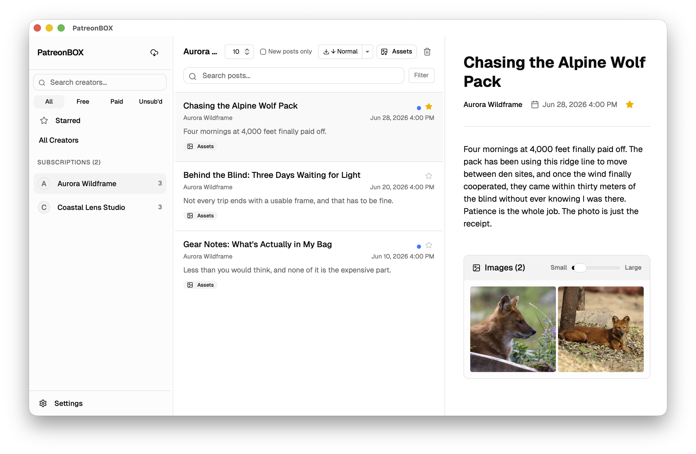
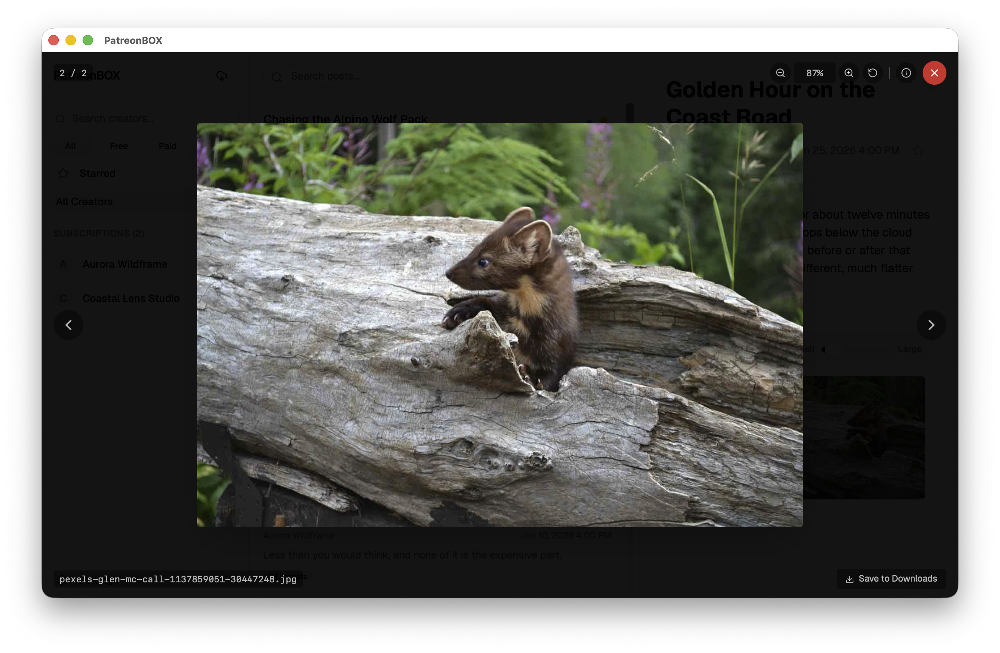
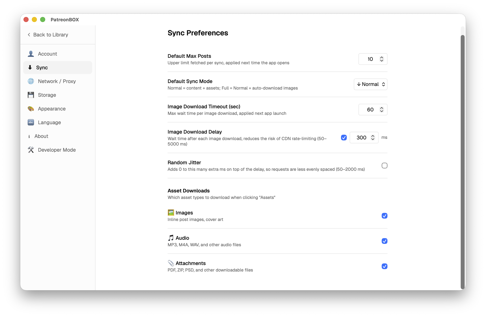

# PatreonBOX

**[English](README.md) | [中文](README.zh.md)**

一款以本地为主的桌面应用，用于存档、浏览和阅读你在 [Patreon](https://www.patreon.com) 上支持的创作者内容——私密、离线、永久保存。

> ⚠️ 这是一个**非官方**的开源项目，仅供**个人使用**，与 Patreon 没有任何隶属或关联关系。仅用于对你已合法订阅内容的个人离线存档。详见文末的[免责声明](#免责声明)。



<sub>本文档中的所有截图均使用内置的**演示模式**和示例内容——无需真实账号即可复现。</sub>

---

## 功能亮点

- **三栏阅读布局** — 侧栏（创作者列表）、帖子列表、阅读视图
- **一键同步** — 直接从 Patreon 抓取你的订阅和帖子内容
- **图片下载** — 批量将所有帖子附件下载到本地
- **全文搜索** — 跨创作者搜索帖子标题与正文
- **收藏帖子** — 为帖子加星标，在专属页面集中浏览
- **同步模式** — 普通（内容+附件）、完整（普通 + 自动下载图片）
- **增量同步** — 遇到已同步过的帖子就提前停止翻页，快速拉取"仅新增"的内容
- **暂停与继续** — 随时中断长时间同步，之后从断点继续
- **置顶创作者** — 拖拽排序最常访问的创作者
- **深色/浅色/跟随系统主题** — 自动跟随操作系统偏好
- **中英双语界面** — 可在「中文」和「English」之间切换
- **代理支持** — 自动检测系统代理、手动指定，或关闭
- **自定义存储位置** — 将图片库迁移到任意目录，并带校验
- **可配置下载超时** — 针对慢速网络调整单次请求超时时间
- **演示模式** — 用内置示例内容体验界面，无需登录
- **完全本地** — 无云同步、无追踪、不存储账号凭据

---

## 使用指南

### 初次启动

初次启动时（或任何未登录状态下），应用会直接打开 **设置 → 账号** 页面。

1. **登录 Patreon** — 在「设置 → 账号」中点击 **登录 Patreon**。会弹出一个窗口供你登录 Patreon，应用检测到登录成功后会自动关闭该窗口。

2. **同步订阅** — 点击侧栏左上角的云下载图标（↓）。应用会抓取你的订阅，抓取完成后，你订阅的创作者将出现在侧栏中。

3. **选择创作者** — 点击任意创作者名称，即可在中间面板加载其帖子列表。

4. **同步帖子** — 点击帖子列表工具栏中的 **Sync** 按钮，下载该创作者的帖子。同步前请先选择同步模式：
   - **↓ 普通** — 完整帖子内容和附件元数据
   - **⬇ 完整** — 普通模式 + 同步结束后自动下载所有图片

   勾选 **仅新帖** 可以在遇到已同步过的帖子时提前停止翻页——适合日常"只想拉新内容"的快速更新，而不是把整个 feed 重新翻一遍。

5. **阅读帖子** — 点击任意帖子行，即可在右侧阅读视图中打开。

---

### 同步控制说明

| 控件 | 说明 |
|------|------|
| **最大帖子数**输入框 | 限制本次抓取的帖子数量（默认值来自设置） |
| **仅新帖**复选框 | 遇到已同步过的帖子就提前停止翻页（增量同步） |
| **模式**下拉菜单 | 同步前切换普通 / 完整模式 |
| **⏸ 暂停** | 中途暂停同步；界面出现显示已完成数量的继续按钮 |
| **↻ 继续 N/...** | 从上次同步断点继续 |
| **↓ 重新** | 丢弃断点，从头开始同步 |
| **✕ 取消** | 取消并清除已保存的断点 |
| **Images / ↻ 继续下载** | 下载（或继续下载）该创作者的所有图片 |

---

### 收藏帖子

- 点击帖子行旁边的 **☆** 图标即可收藏，图标变为金色 ★。
- 点击侧栏的 **收藏** 条目，可查看所有创作者中已收藏的帖子。
- 再次点击 ★（帖子行或阅读视图顶部）即可取消收藏。
- 在收藏页面中取消收藏时，该帖子会立即从列表中移除。

---

### 创作者侧栏

| 功能 | 操作方式 |
|------|----------|
| **筛选标签** | All / Free / Paid / Unsub'd — 按订阅类型筛选 |
| **搜索创作者** | 在搜索框输入文字，按名称过滤 |
| **置顶创作者** | 右键 → 置顶；置顶后出现在侧栏顶部并显示拖拽手柄 |
| **调整置顶顺序** | 拖动 ⠿ 手柄重新排序 |
| **取消置顶** | 右键置顶创作者 → 取消置顶 |
| **All Creators** | 点击可显示所有创作者的帖子 |

---

### 阅读视图

- **图片** — 已下载的图片以画廊形式内嵌显示。通过小/大滑块调整缩略图大小，点击图片可打开灯箱全屏查看。
- **灯箱** — 支持缩放、拖动，可用方向键或屏幕按钮切换图片，点击保存按钮可将图片下载到下载文件夹。
- **原文链接** — 点击在浏览器中打开该帖子的 Patreon 原页面。
- **收藏** — 阅读视图顶部元数据行中的 ★ 按钮可直接切换收藏状态。



---

### 设置

点击侧栏底部的 **Settings** 进入设置页面。设置分为以下几个板块：

| 板块 | 内容 |
|------|------|
| **账号（Account）** | 登录 / 登出 Patreon，连接后显示你的账号信息。未登录时应用启动会直接进入此页。 |
| **同步（Sync）** | 默认最大帖子数、默认同步模式（普通 / 完整）、单次请求下载超时时间。 |
| **网络 / 代理（Network / Proxy）** | 代理模式——**自动**（使用系统代理）、**手动**（填写代理地址）或**关闭**。 |
| **存储（Storage）** | 显示磁盘占用，可打开图片文件夹、迁移到自定义位置，并对已有图片库做带校验的迁移。 |
| **外观（Appearance）** | 主题：浅色 / 深色 / 跟随系统。 |
| **语言（Language）** | 界面语言：中文 / English。 |
| **关于（About）** | 应用版本，以及（面向高级用户的）调试输出模式和演示模式开关。 |

> **默认值：** 开箱即用地关闭了开发者相关选项——开发者模式为关闭，演示模式为关闭，调试输出为**无**（不打印任何内容）。主题默认深色，语言默认英文。



---

### 清除数据

点击帖子列表工具栏中的 🗑 垃圾桶图标，可删除该创作者的所有已同步帖子和图片。创作者条目仍保留在侧栏中，可随时重新同步。

---

## 开发环境搭建

### 前置依赖

- [Node.js](https://nodejs.org/)（v18+）
- [Rust](https://rustup.rs/)（stable）
- 根据你的操作系统安装 [Tauri 前置依赖](https://v2.tauri.app/start/prerequisites/)

### 安装依赖

```bash
npm install
```

### 开发模式运行

```bash
CC=clang npm run tauri dev
```

> **macOS 说明：** 必须添加 `CC=clang`，否则默认的 `gcc` 工具链在 macOS 上链接失败。

### 生产构建

```bash
CC=clang npm run tauri build
```

---

## 架构说明

| 层级 | 技术栈 |
|------|--------|
| 前端 | React + TypeScript + Vite |
| 样式 | Tailwind CSS v4 + shadcn/ui |
| 桌面外壳 | Tauri v2 |
| 数据库 | SQLite（tauri-plugin-sql） |
| 后端命令 | Rust（std::fs，sha2 校验） |
| 内容抓取 | Tauri WebView 窗口（不调用非官方 API） |

### 项目结构

```
src/
  features/
    library/        # 三栏主界面（Sidebar、PostList、ReadingView）
    settings/       # 设置页面与上下文
    import/         # 浏览器导入视图
  lib/              # 数据库工具、日期格式化、设置加载器
  types/            # TypeScript 类型定义（db.ts、settings.ts）
src-tauri/
  src/
    commands/       # Rust Tauri 命令（抓取、文件操作、认证、设置）
    lib.rs          # 应用初始化、插件注册、数据库迁移
  capabilities/     # Tauri 权限声明
  migrations/       # SQL 迁移文件
```

### 同步原理

1. **订阅同步** — 打开一个沙盒化的 Tauri WebView 窗口，导航至 Patreon。内容脚本从页面 DOM 中捕获创作者数据，通过 Tauri 事件回传。不访问任何凭据。
2. **帖子同步** — 第二个抓取窗口访问创作者的 Patreon 页面，逐页浏览帖子列表。帖子通过 `report_scraped_post_page` 批量回传并写入 SQLite。
3. **图片下载** — `download_creator_images` 下载每个附件 URL，保存至 `$APPDATA/images/<creator_id>/`，同时更新数据库中的本地路径记录。

### 数据库

SQLite 文件位于 `$APPDATA/com.hexcatalyst.patreonbox/patreonbox.db`。Schema 迁移在启动时从 `src-tauri/migrations/` 自动执行。前端也会在启动时执行幂等的 `ALTER TABLE`，用于处理发布后新增的列。

---

## 设计原则

- 不进行云同步
- 不调用 Patreon 非官方 API
- 不获取账号凭据或导出 Cookie
- 不在无用户操作时进行后台抓取
- 仅供个人存档使用，不用于内容分发

---

## 免责声明

本软件是独立的非官方工具，与 Patreon **没有**任何隶属、认可或关联关系。

它仅用于**对你已合法订阅、有权访问的内容进行个人离线存档**。你需要为自己的使用行为负全部责任，包括遵守
[Patreon 使用条款](https://www.patreon.com/policy/legal) 以及你所在地区的相关法律。**请勿**将其用于转载、转售或公开分享创作者的付费内容。

本软件按“现状”提供，不附带任何形式的担保。作者对因使用本软件而产生的任何滥用、账号处罚、数据丢失或其他损失概不负责。如果你不同意上述条款，请勿使用本软件。

## 许可证

基于 [MIT 许可证](LICENSE) 发布。
