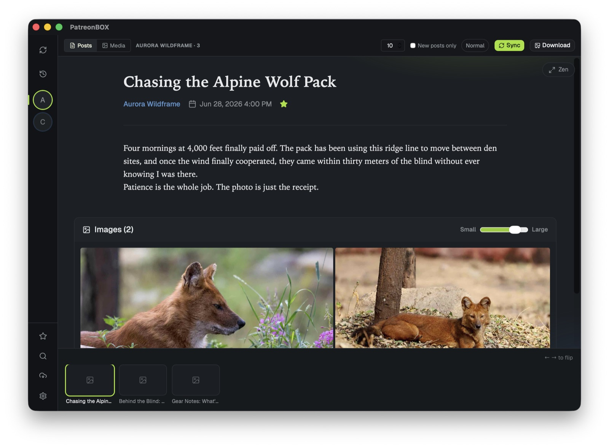
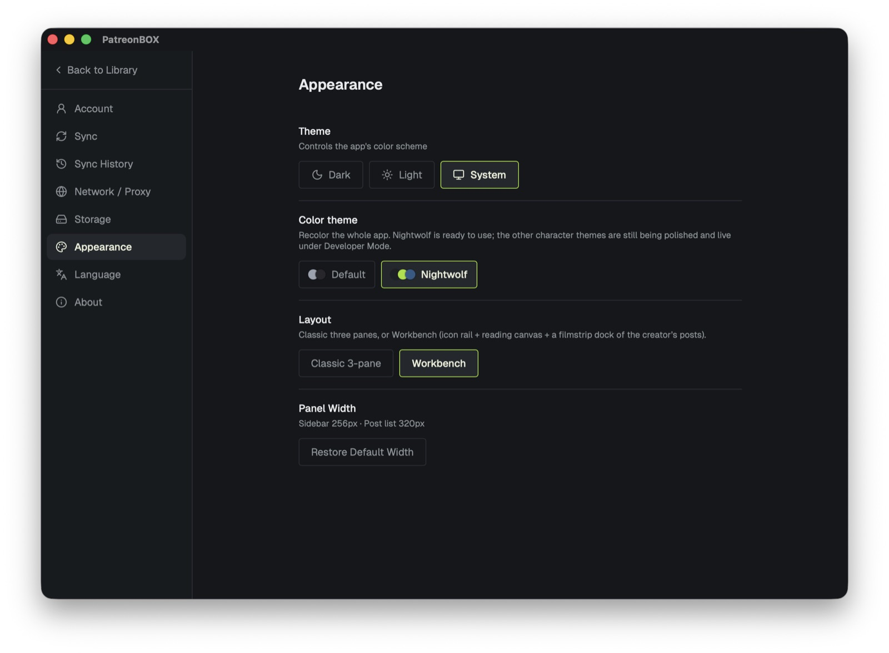
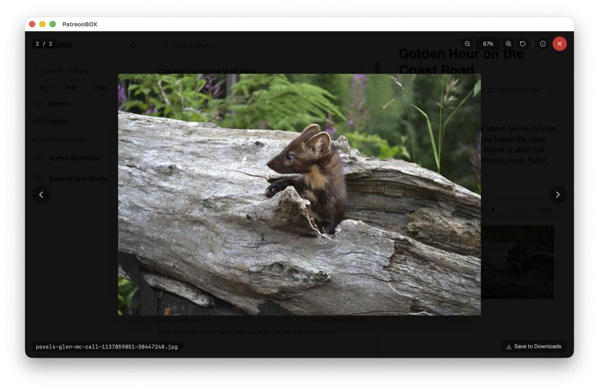
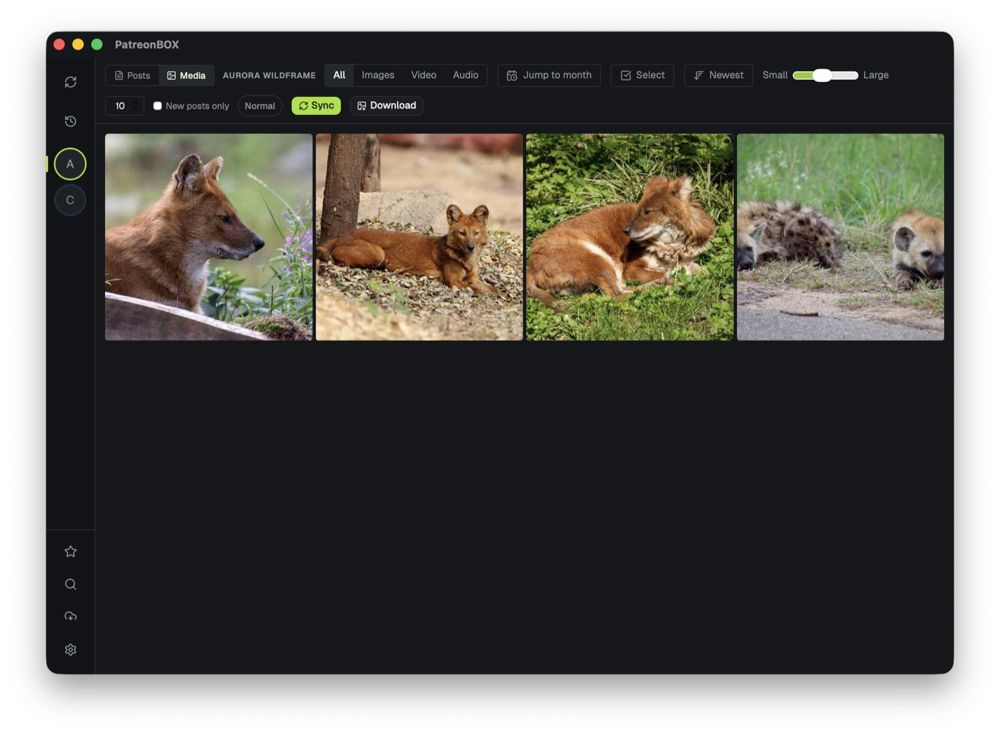
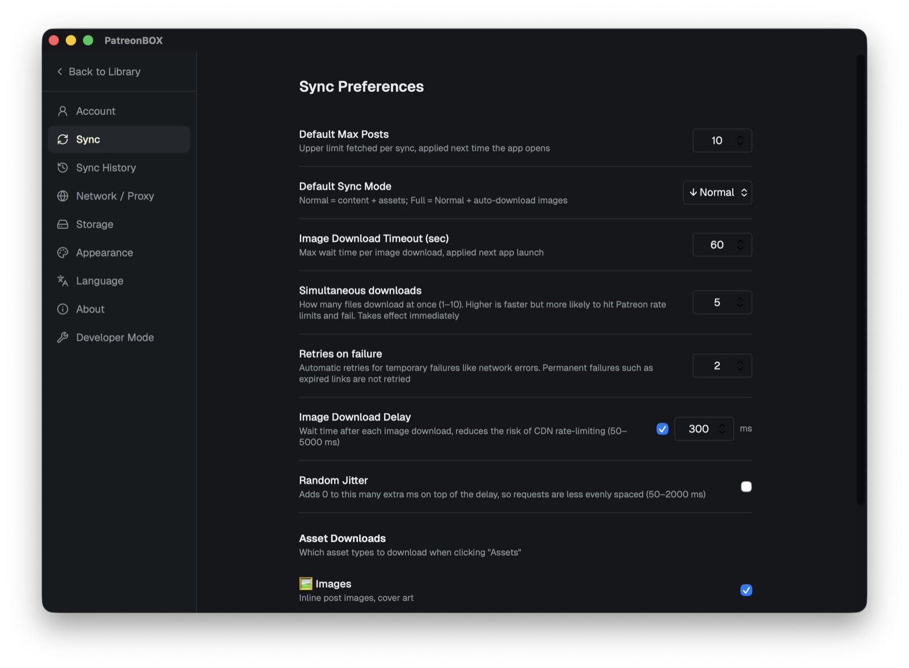

# PatreonBOX

**[English](README.md) | [中文](README.zh.md)**

一款以本地为主的桌面应用，用于存档、浏览和阅读你在 [Patreon](https://www.patreon.com) 上支持的创作者内容——私密、离线、永久保存。

> ⚠️ 这是一个**非官方**的开源项目，仅供**个人使用**，与 Patreon 没有任何隶属或关联关系。仅用于对你已合法订阅内容的个人离线存档。详见文末的[免责声明](#免责声明)。



<sub>本文档中的所有截图均使用内置的**演示模式**和示例内容——无需真实账号即可复现。</sub>

---

## 功能亮点

**阅读与浏览**

- **两种布局** — 经典三栏（侧栏 / 帖子列表 / 阅读视图），或 **Workbench**（图标栏 + 阅读画布 + 底部胶片条）
- **Zen 阅读模式** — 隐去周边界面，只留正文
- **时间线** — 跨所有创作者的「全部动态」时间流
- **⌘K 命令面板** — 快速跳转创作者、切换视图、执行常用操作
- **媒体墙** — 每个创作者的图墙（类似 X 的 Media 页），支持图片 / 视频 / 音频，可按类型筛选
- **时间滑块** — 在媒体墙上按月份快速跳转
- **帖子评论** — 抓取并本地缓存评论，支持嵌套回复、作者徽章、跳转评论者主页
- **收藏** — 逐张图片收藏，以及汇总所有创作者的收藏页（按创作者筛选、多种排序）
- **全文搜索** — 基于 SQLite FTS5 的跨创作者标题与正文搜索

**同步与下载**

- **一键同步** — 直接从 Patreon 抓取你的订阅和帖子内容
- **同步模式** — 普通（内容+附件）、完整（普通 + 自动下载图片）
- **增量同步** — 遇到已同步过的帖子就提前停止翻页，快速拉取「仅新增」的内容
- **暂停与继续** — 中断长时间同步，之后从断点继续
- **全局下载队列** — 集中管理所有下载，可暂停 / 继续 / 取消 / 重试
- **断点续传** — 暂停后从中断处继续，而不是重新下载整个文件
- **吞吐量监控** — 实时的网络与磁盘写入曲线，以及每个文件的速度与剩余时间
- **可调并发** — 同时下载数（1–10）与失败重试次数
- **同步历史** — 记录每次同步结果，失败时在侧栏提示

**外观与其他**

- **配色主题** — Reading Room、Dhole、Nightwolf、Azure Fox
- **深色/浅色/跟随系统主题** — 自动跟随操作系统偏好
- **中英双语界面** — 可在「中文」和「English」之间切换
- **置顶创作者** — 拖拽排序最常访问的创作者
- **代理支持** — 自动检测系统代理、手动指定，或关闭
- **自定义存储位置** — 将图片库迁移到任意目录，并带校验
- **演示模式** — 用内置示例内容体验界面，无需登录
- **完全本地** — 无云同步、无追踪、不存储账号凭据

---

## 使用指南

### 初次启动

初次启动时（或任何未登录状态下），应用会直接打开 **设置 → 账号** 页面。

1. **登录 Patreon** — 在「设置 → 账号」中点击 **登录 Patreon**。会弹出一个窗口供你登录 Patreon，应用检测到登录成功后会自动关闭该窗口。

2. **同步订阅** — 点击侧栏顶部的刷新图标。应用会抓取你的订阅，抓取完成后，你订阅的创作者将出现在侧栏中。

3. **选择创作者** — 点击任意创作者名称，即可在中间面板加载其帖子列表。

4. **同步帖子** — 点击帖子列表工具栏中的 **Sync** 按钮，下载该创作者的帖子。同步前请先选择同步模式：
   - **↓ 普通** — 完整帖子内容和附件元数据
   - **⬇ 完整** — 普通模式 + 同步结束后自动下载所有图片

   勾选 **仅新帖** 可以在遇到已同步过的帖子时提前停止翻页——适合日常「只想拉新内容」的快速更新，而不是把整个 feed 重新翻一遍。

5. **阅读帖子** — 点击任意帖子行，即可在右侧阅读视图中打开。

> 同步过程中会出现一个很小的抓取窗口（默认停在屏幕右下角，接近透明）。它必须保持可见——完全隐藏的窗口会被 macOS 暂停渲染，导致 Patreon 页面不发出抓取所需的请求。如果同步卡住（例如 Patreon 要求重新登录），该窗口会自动放大并回到前台，方便你操作。

---

### 同步控制说明

| 控件 | 说明 |
|------|------|
| **最大帖子数**输入框 | 限制本次抓取的帖子数量（默认值来自设置） |
| **仅新帖**复选框 | 遇到已同步过的帖子就提前停止翻页（增量同步） |
| **模式**下拉菜单 | 同步前切换普通 / 完整模式 |
| **⏸ 暂停** | 中途暂停同步；界面出现显示已完成数量的继续按钮 |
| **↻ 继续 N/...** | 从上次同步断点继续 |
| **↓ 重新** | 丢弃断点，从头开始同步 |
| **✕ 取消** | 取消并清除已保存的断点 |
| **Download** | 把该创作者待下载的附件加入全局下载队列 |

---

### 布局：经典 / Workbench

在 **设置 → 外观** 中切换布局。

- **经典三栏** — 侧栏（创作者）、帖子列表、阅读视图。
- **Workbench** — 左侧细图标栏，中间大幅阅读画布，底部胶片条横向浏览帖子（支持鼠标滚轮左右滚动，← → 键翻页）。

阅读视图右上角的 **Zen** 按钮可进入沉浸阅读模式，隐去周边界面。



---

### 下载

点击侧栏的下载图标进入下载页面，集中管理所有下载任务。

- **吞吐量监控** — 顶部曲线显示网络流入（填充区域）与磁盘写入（细线）。两者通常重合；如果出现「有网络流量但磁盘线贴底」，说明数据没能落盘（磁盘满、权限问题等）。可折叠。
- **每个文件** — 显示实时速度、已下载 / 总大小、预计剩余时间。
- **全部暂停 / 继续** — 暂停会真正停下正在传输的文件，并保留已下载的部分；继续时从断点处续传。
- **取消** — 取消会删除未完成的临时文件，不会留下半个文件。
- **重试** — 失败任务可单独或批量重试。

> **关于失败**：Patreon 的图片链接带有签名且会过期。链接过期导致的 403 属于「永久失败」，不会被自动重试——重新同步该创作者的帖子可以拿到新链接，之后再重试即可。

---

### 收藏

- **收藏帖子** — 点击帖子行旁边的 **☆** 图标，图标变为金色 ★。
- **收藏图片** — 在媒体墙上，把鼠标移到任意图片，点击右上角的星标。
- **收藏页** — 点击侧栏的收藏图标，可查看所有创作者的收藏内容。分「媒体」和「帖子」两个标签，支持按创作者筛选、按收藏时间 / 发布时间 / 名称 / 大小排序，并可调整缩略图大小。

---

### 创作者侧栏

| 功能 | 操作方式 |
|------|----------|
| **筛选标签** | All / Free / Paid / Unsub'd — 按订阅类型筛选 |
| **搜索创作者** | 在搜索框输入文字，按名称过滤 |
| **置顶创作者** | 右键 → 置顶；置顶后出现在侧栏顶部并显示拖拽手柄 |
| **调整置顶顺序** | 拖动 ⠿ 手柄重新排序 |
| **取消置顶** | 右键置顶创作者 → 取消置顶 |
| **All Creators** | 点击可显示所有创作者的帖子 |

---

### 阅读视图

- **图片** — 已下载的图片以等高画廊形式内嵌显示。通过小/大滑块调整密度，点击图片可打开灯箱全屏查看。
- **灯箱** — 支持缩放（滚轮以鼠标位置为中心）、拖动，可用方向键或屏幕按钮切换图片，点击保存按钮可将图片下载到下载文件夹。视频可内嵌播放并全屏。
- **评论** — 帖子下方显示评论，包含嵌套回复和创作者的 **作者** 徽章；点击评论者名字可打开其 Patreon 主页。点 **刷新** 可重新抓取该帖评论。
- **原文链接** — 点击在浏览器中打开该帖子的 Patreon 原页面。
- **收藏** — 阅读视图顶部元数据行中的 ★ 按钮可直接切换收藏状态。



---

### 媒体视图

每个创作者页面的头部都有 **帖子 / 媒体** 切换。切到 **媒体** 即可看到一面类似 X 的图墙，
把该创作者所有帖子里已下载的媒体聚合到一起：

- **类型筛选** — 全部 / 图片 / 视频 / 音频。
- **排序** — 在「最新在前 / 最早在前」之间切换。
- **密度** — 用 小/大 滑块调整缩略图大小。
- **时间滑块** — 拖动右侧的时间胶囊或使用月份轮盘，快速跳到某个月份；另有一键回到顶部 / 底部。
- **灯箱** — 点击任意图片全屏查看，并可在该创作者的整个媒体集里前后翻页；视频可直接播放。
- **批量管理** — 进入选择模式后可框选并批量删除本地文件。



这里只显示已下载的媒体——请先在帖子视图同步/下载。

---

### 设置

点击侧栏底部的 **Settings** 进入设置页面。设置分为以下几个板块：

| 板块 | 内容 |
|------|------|
| **账号（Account）** | 登录 / 登出 Patreon，连接后显示你的账号信息。未登录时应用启动会直接进入此页。 |
| **同步（Sync）** | 默认最大帖子数、默认同步模式、下载超时、同时下载数（1–10）、失败重试次数、下载间隔与抖动、按类型选择要下载的附件。 |
| **网络 / 代理（Network / Proxy）** | 代理模式——**自动**（使用系统代理）、**手动**（填写代理地址）或**关闭**。 |
| **存储（Storage）** | 显示磁盘占用，可打开图片文件夹、迁移到自定义位置，并对已有图片库做带校验的迁移。 |
| **外观（Appearance）** | 主题（浅色 / 深色 / 跟随系统）、配色主题、布局（经典 / Workbench）。 |
| **语言（Language）** | 界面语言：中文 / English。 |
| **同步历史（Sync History）** | 历次同步的结果记录，失败会在侧栏显示提示点。 |
| **自检（Self-Check）** | 检查目录、数据库、代理与网络连通性是否正常。 |
| **关于（About）** | 应用版本，以及（面向高级用户的）开发者模式、调试输出模式和演示模式开关。 |

> **默认值：** 开箱即用地关闭了开发者相关选项——开发者模式为关闭，演示模式为关闭，调试输出为**无**（不打印任何内容）。主题默认深色 + **Nightwolf** 配色，布局默认 **Workbench**，语言默认英文。



---

### 开发者模式

在 **设置 → 关于** 中开启后会解锁：

- **性能悬浮窗** — 可在窗口内自由拖动的浮层，显示帧率、CPU、内存占用（本进程及其子进程）。
- **可见的抓取窗口** — 抓取时显示完整大小、不透明的窗口，便于观察抓取过程。
- **调试输出** — 可将日志输出到终端或写入文件。

---

### 清除数据

点击帖子列表工具栏中的 🗑 垃圾桶图标，可删除该创作者的所有已同步帖子和图片。创作者条目仍保留在侧栏中，可随时重新同步。

---

## 开发环境搭建

### 前置依赖

- [Node.js](https://nodejs.org/)（v18+）
- [Rust](https://rustup.rs/)（stable）
- 根据你的操作系统安装 [Tauri 前置依赖](https://v2.tauri.app/start/prerequisites/)

### 安装依赖

```bash
npm install
```

### 开发模式运行

```bash
CC=clang npm run tauri dev
```

> **macOS 说明：** 必须添加 `CC=clang`，否则默认的 `gcc` 工具链在 macOS 上链接失败。

### 检查与测试

```bash
npm run typecheck                    # 前端类型检查
npm test                             # Rust 单元测试
cd src-tauri && CC=clang cargo check  # 后端编译检查
```

### 生产构建

```bash
CC=clang npm run tauri build
```

---

## 架构说明

| 层级 | 技术栈 |
|------|--------|
| 前端 | React + TypeScript + Vite |
| 样式 | Tailwind CSS v4 + shadcn/ui |
| 桌面外壳 | Tauri v2（锁定 2.10.x） |
| 数据库 | SQLite（tauri-plugin-sql） |
| 后端命令 | Rust（reqwest 下载，sha2 校验，sysinfo 性能采样） |
| 内容抓取 | Tauri WebView 窗口（不调用非官方 API） |

> Tauri 锁定在 2.10.x：2.11 改变了远程页面调用 `invoke()` 的行为，会导致抓取脚本无法回传数据。

### 项目结构

```
src/
  features/
    library/        # 经典三栏界面（Sidebar、PostList、ReadingView、MediaView）
    workbench/      # Workbench 布局（图标栏、阅读画布、胶片条、时间线）
    downloads/      # 下载队列页面与吞吐量监控
    favorites/      # 收藏页（媒体 + 帖子）
    search/         # 全文搜索
    command/        # ⌘K 命令面板
    settings/       # 设置页面与上下文
    dev/            # 开发者性能悬浮窗
  lib/              # 数据库、媒体分类、资源 URL、日期、i18n、主题
  types/            # TypeScript 类型定义（db.ts、settings.ts）
src-tauri/
  src/
    commands/       # Rust Tauri 命令（抓取、下载、评论、文件、设置等）
    lib.rs          # 应用初始化、插件注册、数据库迁移
  capabilities/     # Tauri 权限声明
  migrations/       # SQL 迁移文件
```

### 同步原理

1. **订阅同步** — 打开一个沙盒化的 Tauri WebView 窗口，导航至 Patreon。内容脚本从页面 DOM 中捕获创作者数据，通过 Tauri 事件回传。不访问任何凭据。
2. **帖子同步** — 第二个抓取窗口访问创作者的 Patreon 页面，逐页浏览帖子列表。帖子通过 `report_scraped_post_page` 批量回传并写入 SQLite。
3. **评论抓取** — 同步后自动为新帖子抓取评论。Patreon 的 `/api/*` 有机器人防护，普通 HTTP 请求会被拒绝，因此评论同样通过已登录的 WebView 抓取。
4. **附件下载** — 帖子同步只记录附件元数据；实际下载由全局下载队列（`start_downloads`）完成，多个 worker 并发流式写入 `$APPDATA/images/<creator_id>/`，完成后更新数据库中的本地路径。

> 为什么抓取要用 WebView 而不是直接发 HTTP 请求：Patreon 的接口有机器人防护，带 Cookie 的普通请求会返回 403，只有真实的、已登录的浏览器环境能通过。

### 数据库

SQLite 文件位于 `$APPDATA/com.hexcatalyst.patreonbox/patreonbox.db`。Schema 迁移在启动时从 `src-tauri/src/lib.rs` 中声明的版本化迁移列表自动执行——这是 schema 的唯一真相源。

---

## 设计原则

- 不进行云同步
- 不调用 Patreon 非官方 API
- 不获取账号凭据或导出 Cookie
- 不在无用户操作时进行后台抓取
- 仅供个人存档使用，不用于内容分发

---

## 免责声明

本软件是独立的非官方工具，与 Patreon **没有**任何隶属、认可或关联关系。

它仅用于**对你已合法订阅、有权访问的内容进行个人离线存档**。你需要为自己的使用行为负全部责任，包括遵守
[Patreon 使用条款](https://www.patreon.com/policy/legal) 以及你所在地区的相关法律。**请勿**将其用于转载、转售或公开分享创作者的付费内容。

本项目是一个借助 AI 大量辅助、快速构建的业余项目（俗称 "vibe coding" 的产物），**未经**详尽测试或审查。它可能存在 bug 或出现意料之外的行为，尤其是在作者从未测试过的平台或配置上。请自行备份重要数据，并自担使用风险。

本软件按"现状"提供，不附带任何形式的担保。作者对因使用本软件而产生的任何滥用、账号处罚、数据丢失或其他损失概不负责。如果你不同意上述条款，请勿使用本软件。

## 许可证

基于 [MIT 许可证](LICENSE) 发布。
